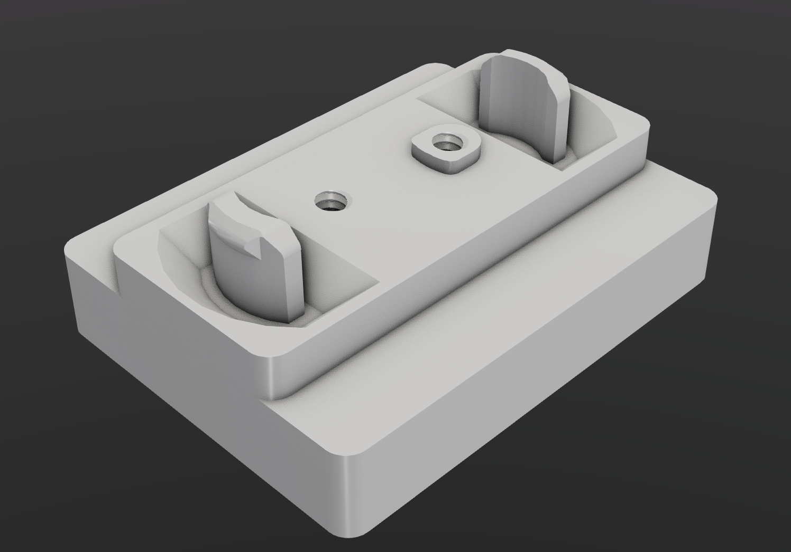

# Printable feet to mount wheels on the Quibe

---
This model contains printable mounts for castor wheels.  
It should be compatible with wheels with 35x28mm hole spacing. I personally used a set of castor wheels bought at the local Dollar store (Action).  
Any other hole spacing requires editing the model.  

## Basics
To use the model just grab it from the Output folder, there are both and a left handed version, you should print 2 of each.  

---

## Adjusting the model

Install the requirements from requirements.txt, probably best in a clean python venv.  
The model is written in the build123d python library.
Do note that the model is in no means optimized, there are some hard-coded values in there.  
There are little to no comments   

If you just want to adjust the hole spacing you only have to touch `'X spacing'` and `'Y spacing'` in the config file.
This should generally be safe.

---

## credits
This model includes sample feet made by coolermaster, they can be found here: https://www.printables.com/model/588842-qube-500-sample-holders